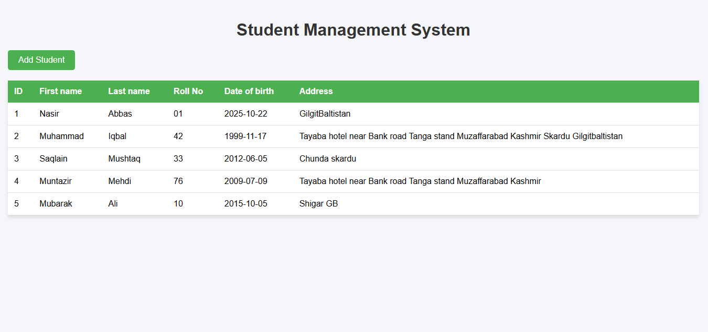
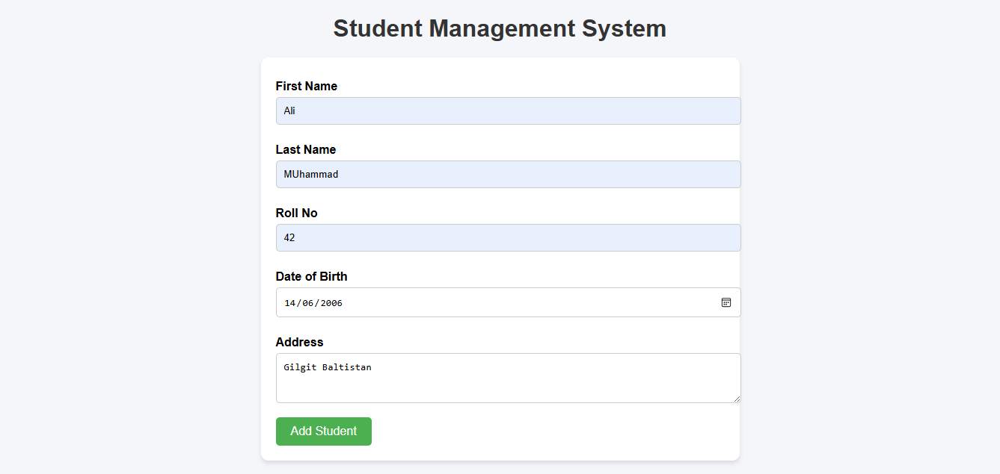

# Lab Task 11  
Web Design & Development Course – SE-42  

## 📷 Preview  
## Table View
 

## Add / Form View
 

## 📄 Project Overview  
This task demonstrates [brief description — e.g. “a data table with CRUD operations”, “form for adding entries and listing them in a table”, or “interactive table + form interface”]. Key features include:  
- Display of data in a structured table  
- Form or interface to **Add** new entries  
- Input validation (if any)  
- Dynamic update of table (if JavaScript is used)  
- Clean and responsive layout  

## 🛠 Setup & Running Locally  
1. Clone the repository:  
   ```bash
   git clone https://github.com/MuhammadIqbal009/Web_Design_and_Development_Course_2022-SE-42.git
    ```
   
## 👤 Author

- Name: Mohammad Iqbal
- Roll No: 2022-SE-42
- Course: Web Design & Development
