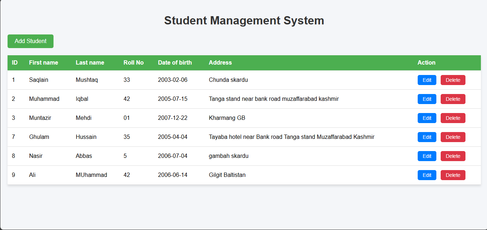
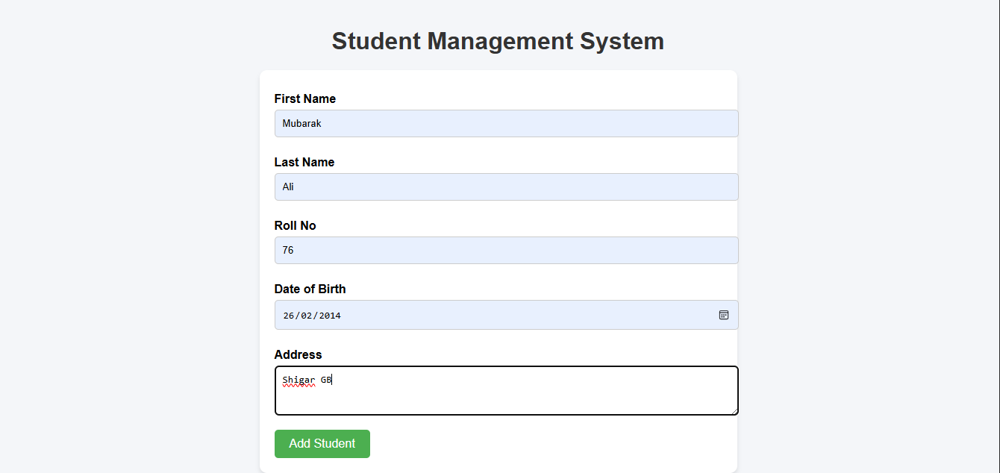
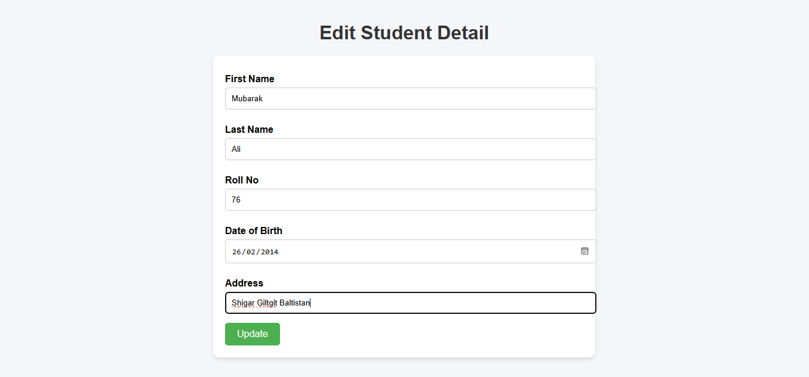

# Lab Task 12  
Web Design & Development Course – SE-42  

## 📷 Preview  

### Table View  
  

### Add Entry  
  

### Edit Entry  
  

## 📄 Project Overview  
This lab demonstrates a CRUD interface using HTML, CSS (and possibly JavaScript) to manage data entries. Core features include:  
- Displaying data records in a **table**  
- **Adding** new entries via a form  
- **Editing** existing entries with a form or inline edit  
- Optionally **deleting** entries  
- Validation checks (if applied)  
- Responsive, clean UI with semantic markup  

## 🛠 Setup & Running Locally  
1. Clone the repository:  
   ```bash
   git clone https://github.com/MuhammadIqbal009/Web_Design_and_Development_Course_2022-SE-42.git
   ```
   
## 👤 Author

- Name: Mohammad Iqbal
- Roll No: 2022-SE-42
- Course: Web Design & Development
